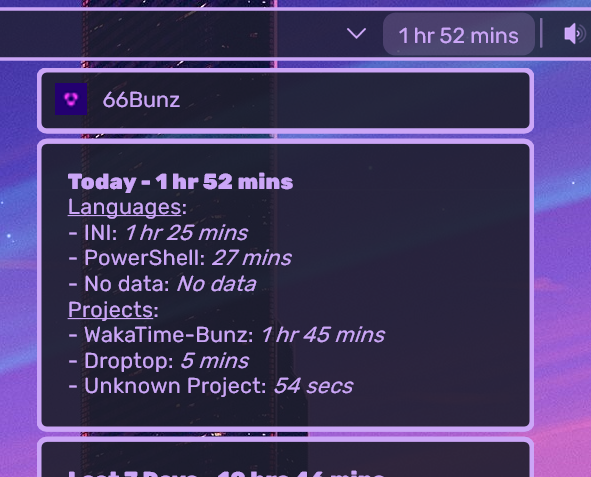

<h1 align="center">
   
  
   
  WakaTime - Bunz
   
</h1>

<h4 align="center">Displays your WakaTime stats.</h4>

  
  
  
  

  <a href="#key-features">Key Features</a> •
  <a href="#how-to-use">How To Use</a> •
  <a href="#download">Download</a> •
  <a href="#credits">Credits</a> •
  <a href="#license">License</a>

## Key Features
Let's you display your coding stats on the bar of:
- Today
- Last 7 days
- Last 30 days
- All time

Inside the app you'll find more informations for the same time range.

You can decide what to display inside the app and hide/show each section.

## How to use
1. Inside the settings of the app insert your api key (https://wakatime.com/settings/api-key) and click Enter
2. Then click on `Reload Everything` and the app should start working.
3. If on the bar it's not showing anything but on the app there is your data, right click on droptop and click `Refresh Droptop`.

## Download
Download from [releases](https://github.com/66Bunz/DroptopFour-WakaTime/releases) or from the [website](https://droptopfour.com/community-apps?id=29)

## Credits
Since this is not an official WakaTime app, bviously to the [WakaTime project](https://wakatime.com/)

## License

[GNU General Public License v3.0](LICENSE)

Feel free to modify or redistribute these Rainmeter skins as much as you want. Just:
- Link back to me somehow
- Use ths same license
